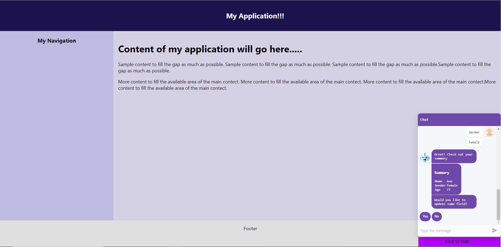
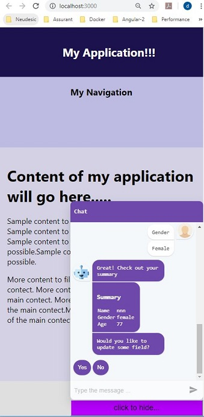

Recently I got an requirement of integrating [react-simple-chatbot](https://lucasbassetti.com.br/react-simple-chatbot/#/docs/form) to an existing react application. The challenge was understanding the layout of existing application and little bit of learning curve on react-simple-chatbot. The application layout was not very impressive and I had to change it get the desired result. So instead of making change of existing app, I design a layout using grid display and fixed position styles. When app run it looks like as below -

**Desktop view**



**Phone view**




This post will be help to all those who struggle laying out the application and finally integrate simple chatbot to existing application. Complete source can be downloaded from Git repository [react-chatbot](https://github.com/kumardh/react-chatbot).

# Step 1: Create SimpleForm to add steps to Chatbot

Install following 2 packages -

    "react-simple-chatbot": "^0.6.1",
    "styled-components": "^4.3.2"
You can run following command in terminal

```
npm install react-native-chatbot --save
npm install styled-components --save
```

**SimpleForm .js**

```
import React, { Component } from 'react';
import ChatBot from 'react-simple-chatbot';
import Review from './Review';

class SimpleForm extends Component {
    render() {
      return (
        <ChatBot
          steps={[
            {
              id: '1',
              message: 'What is your name?',
              trigger: 'name',
            },
            {
              id: 'name',
              user: true,
              trigger: '3',
            },
            {
              id: '3',
              message: 'Hi {previousValue}! What is your gender?',
              trigger: 'gender',
            },
            {
              id: 'gender',
              options: [
                { value: 'male', label: 'Male', trigger: '5' },
                { value: 'female', label: 'Female', trigger: '5' },
              ],
            },
            {
              id: '5',
              message: 'How old are you?',
              trigger: 'age',
            },
            {
              id: 'age',
              user: true,
              trigger: '7',
              validator: (value) => {
                if (isNaN(value)) {
                  return 'value must be a number';
                } else if (value < 0) {
                  return 'value must be positive';
                } else if (value > 120) {
                  return `${value}? Come on!`;
                }
  
                return true;
              },
            },
            {
              id: '7',
              message: 'Great! Check out your summary',
              trigger: 'review',
            },
            {
              id: 'review',
              component: <Review />,
              asMessage: true,
              trigger: 'update',
            },
            {
              id: 'update',
              message: 'Would you like to update some field?',
              trigger: 'update-question',
            },
            {
              id: 'update-question',
              options: [
                { value: 'yes', label: 'Yes', trigger: 'update-yes' },
                { value: 'no', label: 'No', trigger: 'end-message' },
              ],
            },
            {
              id: 'update-yes',
              message: 'What field would you like to update?',
              trigger: 'update-fields',
            },
            {
              id: 'update-fields',
              options: [
                { value: 'name', label: 'Name', trigger: 'update-name' },
                { value: 'gender', label: 'Gender', trigger: 'update-gender' },
                { value: 'age', label: 'Age', trigger: 'update-age' },
              ],
            },
            {
              id: 'update-name',
              update: 'name',
              trigger: '7',
            },
            {
              id: 'update-gender',
              update: 'gender',
              trigger: '7',
            },
            {
              id: 'update-age',
              update: 'age',
              trigger: '7',
            },
            {
              id: 'end-message',
              message: 'Thanks! Your data was submitted successfully!',
              end: true,
            },
          ]}
        />
      );
    }
  }
  
  export default SimpleForm;
```
In step id review you might have noticed at the end of user input we render Review component. The important point to note here is - user inputs are passed to this component as props.

**Review .js**

```
import React, { useState, useEffect } from 'react';
import PropTypes from 'prop-types';

const Review = (props)  => {
  const [state, setState] = useState({ name: '', gender: '', age: ''});
  
  useEffect(() => {
    const { steps } = props;
    const { name, gender, age } = steps;
    setState({ name, gender, age });
  }, [props])

    const { name, gender, age } = state;
    return (
      <div style={{ width: '100%' }}>
        <h3>Summary</h3>
        <table>
          <tbody>
            <tr>
              <td>Name</td>
              <td>{name.value}</td>
            </tr>
            <tr>
              <td>Gender</td>
              <td>{gender.value}</td>
            </tr>
            <tr>
              <td>Age</td>
              <td>{age.value}</td>
            </tr>
          </tbody>
        </table>
      </div>
    );
}

Review.propTypes = {
  steps: PropTypes.object,
};

Review.defaultProps = {
  steps: undefined,
};

export default Review;
```

API reference of Chatbot and steps can be found [here](https://lucasbassetti.com.br/react-simple-chatbot/#/docs/chatbot).

# Step 2: Layout you app and integrate SimpleForm

First look at the Application layout and will explain key points later.

**App.js**

```
import React, { useState } from 'react';
import SimpleForm from './SimpleForm';
import './App.css';

const App = (props) => {
  let [showChat, setShowChat] = useState(false);

  const startChat = () => { setShowChat(true); }
  const hideChat = () => { setShowChat(false); }

    return (
      <>
      <div className = "header">
        <h2>My Application!!!</h2>
      </div>
      <div className = "main">
        <div className ="nav">
          <h3>My Navigation</h3>
        </div>
        <div className ="content">
          <div style = {{padding:"20px"}}>
            <h1>Content of my application will go here.....</h1>
            <p>Sample content to fill the gap as much as possible. Sample content to fill the gap as much as possible.
            Sample content to fill the gap as much as possible.Sample content to fill the gap as much as possible.</p>
            <p>More content to fill the available area of the main contect. More content to fill the available area of the main contect.
            More content to fill the available area of the main contect.More content to fill the available area of the main contect. </p>
          </div>
        </div>
      </div>
      <div className = "footer">Footer</div>
      <div className = "bot">
        <div style ={{display: showChat ? "" : "none"}}>
          <SimpleForm></SimpleForm>
        </div>      
        {/* <div> {showChat ? <SimpleForm></SimpleForm> : null} </div> */}
        <div>
          {!showChat 
            ? <button className="btn" onClick={() => startChat()}>click to chat... </button> 
            : <button className="btn" onClick={() => hideChat()}>click to hide... </button>}
        </div>
      </div>      
      </>
    )
}

export default App;
```

**App.css**

```
body {
    font-size: 20px;
}
.header {
    position: fixed;
    top: 0;
    width: 100%;
    text-align: center;
    background-color: rgb(28, 18, 78);
    color: white;
    padding: 20px;
}

.main {
    display: grid;
    height: 800px;    
    padding-top: 130px;
    /* grid-template-columns: 1fr 6fr; */
    grid-template-columns: repeat(auto-fit, minmax(479px, auto));
}

.nav {
    background-color: rgba(115, 110, 192, 0.466);
    text-align: center;
}

.content {
    background-color: rgba(160, 157, 195, 0.466);
}

.footer {
    height: 400px;
    text-align: center;
    padding: 20px;
    background-color: rgb(223, 223, 223);
}

.bot {
    bottom: 0;
    right : 0;
    position: fixed;
    width: 350px;
}

.btn {
    font-size: 20px;
    float: right;
    width: 100%;
    padding: 8px;
    background-color: rgb(183, 0, 255)
}
```

**Explanation -** 

Here div with class bot wrap SimpleForm and button at the bottom. Display style of the wrapping div are toggled to hide/show based on the showChat state. We don't want to unmount the component here, because if we unmount/ mount then the history of the chat will be lost. You can see the below commented code which mount/unmounted based of the showChat  value.
Also, The buttons 'click to chat... ', 'click to hide... ' are dynamically mounted based on the  showChat state.

```
<div className = "bot">
        <div style ={{display: showChat ? "" : "none"}}>
          <SimpleForm></SimpleForm>
        </div>      
        {/* <div> {showChat ? <SimpleForm></SimpleForm> : null} </div> */}
        <div>
          {!showChat 
            ? <button className="btn" onClick={() => startChat()}>click to chat... </button> 
            : <button className="btn" onClick={() => hideChat()}>click to hide... </button>}
        </div>
      </div>   
```

Now, I will explain the css part, I am setting position: fixed and top: 0 to header class. Reason being I header to stay visible when user scroll down.

```
position: fixed;
top: 0;
```

For the same reason I am setting bot class to be fixed with 0 bottom and 0 right.

```
.bot {
    bottom: 0;
    right : 0;
    position: fixed;
    width: 350px;
}
```

Another interesting class that needs attention is main. You can notice I am making nav and content to be still responsive along with maintaining the 30%- 70% width for nav and content.